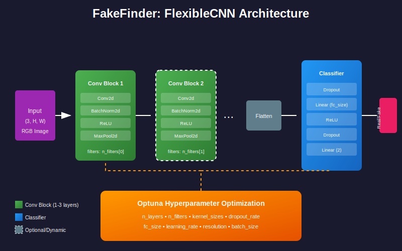

# FakeFinder: AI-Generated Image Detection with AutoML

[](https://www.python.org/downloads/)
[](https://pytorch.org/)
[](https://optuna.org/)
[](https://opensource.org/licenses/MIT)

An automated machine learning pipeline for detecting AI-generated images using dynamic CNN architectures and Optuna hyperparameter optimization.

## 🎯 Project Overview

With the rise of generative AI models like Stable Diffusion, MidJourney, and DALL·E, distinguishing real images from AI-generated ones has become increasingly important. This project implements a **FakeFinder** system that:

- Uses **flexible CNN architectures** that adapt based on hyperparameters
- Employs **Optuna AutoML** to automatically discover optimal model configurations  
- Achieves **73%+ accuracy** on the AI vs Real Images dataset
- Balances **model performance vs. efficiency** using trainable parameter analysis

## 🏗️ Architecture

### FlexibleCNN

The core model is a dynamically-constructed CNN that builds itself based on hyperparameters:



```
Input (3, H, W)
    │
    ▼
┌─────────────────────────────────┐
│  Convolutional Block (×n_layers)│
│  ┌─────────────────────────────┐│
│  │ Conv2d → BatchNorm → ReLU  ││
│  │         → MaxPool2d        ││
│  └─────────────────────────────┘│
└─────────────────────────────────┘
    │
    ▼
  Flatten
    │
    ▼
┌─────────────────────────────────┐
│        Classifier               │
│  Dropout → Linear → ReLU       │
│  → Dropout → Linear (2 classes)│
└─────────────────────────────────┘
    │
    ▼
Output (real/fake)
```

**Key Features:**
- Variable number of convolutional blocks (1-3 layers)
- Configurable filters per layer (8-64)
- Flexible kernel sizes (3×3 or 5×5)
- Dynamic classifier creation based on feature map dimensions

### Hyperparameter Search Space

| Parameter | Range | Type |
|-----------|-------|------|
| `n_layers` | 1-3 | Integer |
| `n_filters` | 8-64 (step 8) | Integer per layer |
| `kernel_sizes` | 3, 5 | Categorical per layer |
| `dropout_rate` | 0.1-0.5 | Float |
| `fc_size` | 64-512 (step 64) | Integer |
| `learning_rate` | 1e-4 to 1e-2 | Log-uniform |
| `resolution` | 16, 32, 64 | Categorical |
| `batch_size` | 8, 16 | Categorical |

## 📊 Results

### Best Model Configuration (73.2% Accuracy)

```python
{
    "n_layers": 2,
    "n_filters": [32, 24],
    "kernel_sizes": [5, 3],
    "dropout_rate": 0.17,
    "fc_size": 384,
    "learning_rate": 0.000732,
    "resolution": 16,
    "batch_size": 16
}
```

### Optimization Study Results

After 25 trials of Bayesian optimization:

| Metric | Value |
|--------|-------|
| Best Accuracy | 73.2% |
| Median Accuracy | 66.7% |
| Training Time/Trial | ~3 minutes |

### Accuracy vs. Model Efficiency

The study revealed interesting trade-offs between model complexity and performance:

- **Smaller models** (16px resolution, 2 layers) often outperformed larger ones
- **Low dropout** (0.1-0.2) worked best for this dataset size
- **Mid-range FC layers** (256-384) balanced capacity and generalization

## 🚀 Quick Start

### Installation

```bash
git clone https://github.com/yourusername/fakefinder-automl.git
cd fakefinder-automl
pip install -r requirements.txt
```

### Dataset

Download the [AI-Generated Images vs Real Images](https://www.kaggle.com/datasets/tristanzhang32/ai-generated-images-vs-real-images) dataset and organize as:

```
data/
├── train/
│   ├── real/
│   └── fake/
└── test/
    ├── real/
    └── fake/
```

### Run Hyperparameter Optimization

```bash
python train.py --data-path ./data --n-trials 25 --n-epochs 4
```

With persistent storage:
```bash
python train.py --data-path ./data --n-trials 25 --storage sqlite:///study.db
```

### Train a Single Model

```python
from model import FlexibleCNN
import torch

# Best configuration from optimization
model = FlexibleCNN(
    n_layers=2,
    n_filters=[32, 24],
    kernel_sizes=[5, 3],
    dropout_rate=0.17,
    fc_size=384
)

# Check model size
print(f"Trainable parameters: {model.get_trainable_params():,}")
```

## 📁 Project Structure

```
fakefinder-automl/
├── model.py              # FlexibleCNN architecture
├── train.py              # Optuna optimization pipeline
├── fakefinder.ipynb      # Interactive notebook with full analysis
├── requirements.txt      # Dependencies
├── README.md             # This file
└── images/               # Visualizations and results
```

## 🔬 Technical Highlights

### Dynamic Architecture Construction

The `FlexibleCNN` uses `nn.ModuleList` to dynamically build convolutional blocks:

```python
self.features = nn.ModuleList()
for i in range(n_layers):
    block = nn.Sequential(
        nn.Conv2d(in_channels, n_filters[i], kernel_sizes[i], padding='same'),
        nn.BatchNorm2d(n_filters[i]),
        nn.ReLU(),
        nn.MaxPool2d(2, 2)
    )
    self.features.append(block)
```

The classifier is created lazily on the first forward pass, automatically adapting to any input resolution:

```python
def forward(self, x):
    for layer in self.features:
        x = layer(x)
    x = torch.flatten(x, start_dim=1)
    
    if self.classifier is None:
        self._create_classifier(x.shape[1])  # Dynamic size
    
    return self.classifier(x)
```

### Optuna Integration

The search space uses Optuna's suggest API for efficient Bayesian optimization:

```python
def design_search_space(trial):
    n_layers = trial.suggest_int("n_layers", 1, 3)
    n_filters = [
        trial.suggest_int(f"n_filters_layer{i}", 8, 64, step=8)
        for i in range(n_layers)
    ]
    learning_rate = trial.suggest_float("learning_rate", 1e-4, 1e-2, log=True)
    # ...
```

## 📈 Future Improvements

- [ ] Add data augmentation (horizontal flip, color jitter)
- [ ] Implement early stopping with pruning
- [ ] Add transfer learning from pretrained models
- [ ] Expand to multi-class detection (identify which AI model generated the image)
- [ ] Deploy as a web application

## 📚 References

- [Optuna Documentation](https://optuna.readthedocs.io/)
- [AI-Generated Images vs Real Images Dataset](https://www.kaggle.com/datasets/tristanzhang32/ai-generated-images-vs-real-images)
- [PyTorch Documentation](https://pytorch.org/docs/)

## 📄 License

This project is licensed under the MIT License - see the [LICENSE](LICENSE) file for details.

## 🙏 Acknowledgments

- DeepLearning.AI for the course structure and guidance
- Kaggle community for the dataset
- Optuna team for the excellent AutoML framework
